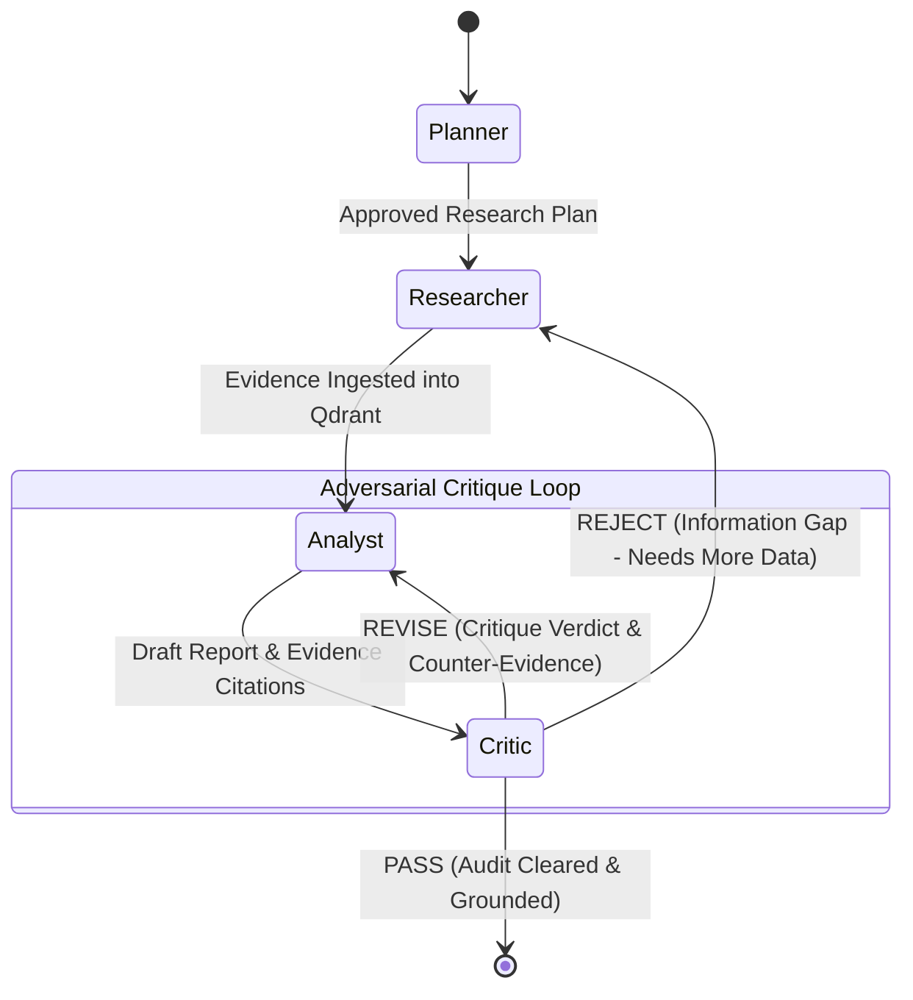

# Autonomous Research Agent Architecture

## 1. System Overview

The **Autonomous Research Agent** is a production-grade multi-node system designed for autonomous inquiry, multi-source evidence synthesis, and rigorous factual auditing. Rather than relying on a linear, ungrounded LLM generation chain, this architecture enforces an asynchronous state-directed pipeline with explicit evidence anchoring and red-teaming.

```
+---------------+     Plan & Sub-queries     +------------------+
|    Planner    | ------------------------> |    Researcher    |
+---------------+                            +------------------+
                                                      |
                                                      | Raw Data & Extracted Chunks
                                                      v
                                            +--------------------+
                                            |   Evidence Store   |
                                            |     (Qdrant)       |
                                            +--------------------+
                                                      |
                                                      | Grounded Vector /
                                                      | Payload Retrieval
                                                      v
+---------------+     Pass (Final Report)    +------------------+
| Final Output  | <------------------------- |     Analyst      |
+---------------+                            +------------------+
                                                  ^        |
                              Feedback & Edits    |        | Draft Report &
                             (Iterative Revision) |        | Claim-Evidence Mappings
                                                  |        v
                                             +------------------+
                                             |      Critic      |
                                             |  (Adversarial)   |
                                             +------------------+
```

---

## 2. Four-Node Pipeline Breakdown

### Node 1: Planner (`src/agents/planner.py`)
- **Primary Function**: Decompose the user's high-level research goal or investment hypothesis into an executable Directed Acyclic Graph (DAG) of research objectives.
- **Key Responsibilities**:
  - Break down ambiguous queries into concrete, falsifiable sub-hypotheses.
  - Determine search queries, data acquisition targets (financial filings, earnings transcripts, news, macro series), and extraction constraints.
  - Define completion criteria and budget boundaries (max iterations, max retrieval count).
- **Output Artifact**: `ResearchPlan` containing an ordered list of `ResearchGoalTask` items with designated tool dispatch targets.

### Node 2: Researcher (`src/agents/researcher.py`)
- **Primary Function**: Execute data gathering against external environments and ingest structured/unstructured documents into the vector database.
- **Key Responsibilities**:
  - Dispatch tool operations to financial APIs (`yfinance`), document extractors (`docling`), and web scrapers.
  - Convert multimodal financial documents (annual reports, 10-Ks, presentations) into structured, semantic representations with Docling.
  - Ingest extracted document chunks with rich metadata directly into the **Evidence Store (Qdrant)**.
- **Output Artifact**: `EvidenceManifest` detailing indexed items, chunk identifiers, and vector collection metadata.

### Node 3: Analyst (`src/agents/analyst.py`)
- **Primary Function**: Formulate data-driven arguments, synthesize disparate sources, and draft comprehensive research findings.
- **Key Responsibilities**:
  - Query Qdrant for semantic and hybrid lexical-vector retrieval across indexed evidence.
  - Triangulate metrics across quantitative financial data (prices, ratios, margins) and qualitative reports.
  - Enforce strict citation standards: every material factual statement or metric must cite an immutable `evidence_id` located in Qdrant.
- **Output Artifact**: `DraftReport` containing claims, evidence citations, synthesized tables, and prospective conclusions.

### Node 4: Critic (`src/agents/critic.py`)
- **Primary Function**: **Adversarially evaluate** and red-team the Analyst's draft report before publication.
- **Core Principle**: **The Critic node runs adversarially against the Analyst.** It acts not as an agreeable summarizer, but as an aggressive auditor seeking contradictions, ungrounded assertions, logical fallacies, and confirmation bias.
- **Key Responsibilities**:
  - **Grounding Verification**: Validates every claim citation by querying the cited `evidence_id` in Qdrant and computing semantic overlap and factual consistency. Any uncited or misattributed claim fails immediately.
  - **Counter-Hypothesis Generation**: Formulates alternative explanations and checks whether the research adequately disproved opposing views (e.g., bear case vs. bull case).
  - **Confirmation Bias Detection**: Flags selective citation of evidence when contradictory evidence exists in Qdrant.
  - **Critique Verdict**: Issues a structured `CritiqueResult` (`status: PASS | REJECT | REVISE`) with specific, actionable remediation steps.
- **Adversarial Loopback**: If the Critic rejects or requests revisions, execution loops back to the Analyst (or back to the Researcher if critical evidence is missing), subject to a maximum loop iteration guard.

---

## 3. Evidence Store Architecture (Qdrant)

**The Evidence Store uses Qdrant** as the source of truth for all external information retrieved during the pipeline lifecycle.

### Collection Schema
- **Vector Dimensions**: Model-dependent (e.g., 768 or 1536 dimensions) using Cosine distance.
- **Payload Indexing**:
  - `evidence_id` (UUIDv4): Unique identifier cited in analytical reports.
  - `document_source` (Keyword): File path, URL, or API endpoint.
  - `document_type` (Keyword): e.g., `sec_filing`, `earnings_transcript`, `financial_table`, `news`.
  - `timestamp` (Datetime/Integer): Ingestion timestamp and published timestamp.
  - `content` (Text): Full markdown text generated by Docling.
  - `page_or_slide` (Integer): Specific document location for human verification.
  - `extracted_entities` (Keywords): Ticker symbols, companies, executive names, metric names.

### Grounding and Verification Flow
1. Docling processes raw documents and produces hierarchical chunks preserving tables, headers, and footnotes.
2. Embeddings are generated and payloads are upserted into Qdrant.
3. The Analyst retrieves chunks using similarity search and attaches `evidence_id` tags to generated findings.
4. The Critic inspects each `evidence_id` against the stored Qdrant payload to confirm citation veracity without hallucination.

---

## 4. Pipeline State Machine & Adversarial Loop



### Loop Termination Conditions
- **Pass Threshold**: All claims verified against Qdrant evidence; no critical vulnerabilities or unaddressed counter-arguments remain.
- **Max Iterations Guard**: Maximum of 3 revision cycles. If convergence is not achieved, the pipeline emits a flagged report with an explicit "Unresolved Discrepancies" disclaimer.

---

## 5. Directory Layout & Module Responsibilities

```
autonomous_research_agent/
├── pyproject.toml              # Build config and exact project dependencies
├── docs/
│   └── architecture.md         # System architecture specification
├── src/
│   ├── __init__.py
│   ├── agents/
│   │   ├── __init__.py
│   │   ├── planner.py          # Plan decomposition & query orchestration
│   │   ├── researcher.py       # Data retrieval & Qdrant ingestion
│   │   ├── analyst.py          # Evidence synthesis & citation drafting
│   │   └── critic.py           # Adversarial auditor & factual grounding verification
│   ├── tools/
│   │   ├── __init__.py
│   │   ├── financial_api.py    # yfinance market data and financials wrapper
│   │   └── docling_qdrant.py   # Docling document parsing & Qdrant store connector
│   └── eval/
│       ├── __init__.py
│       └── llmops_harness.py   # LLM-as-a-judge evaluation & grounding benchmark harness
└── tests/
    ├── __init__.py
    └── test_scaffold.py        # Pipeline & module interface validation tests
```
